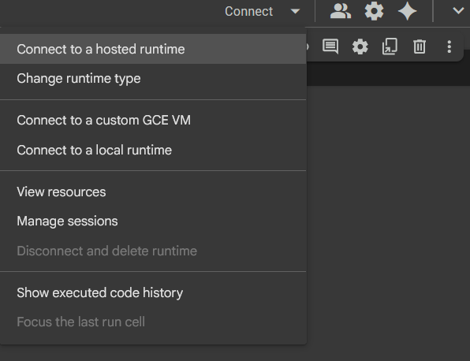
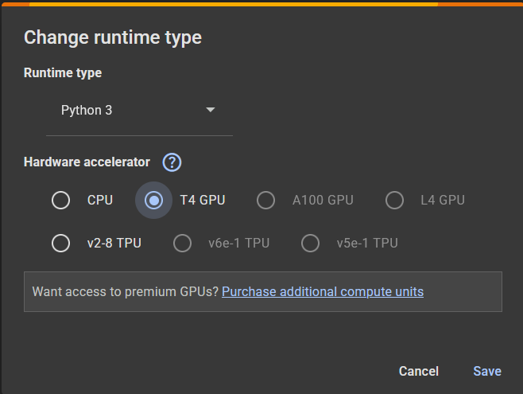
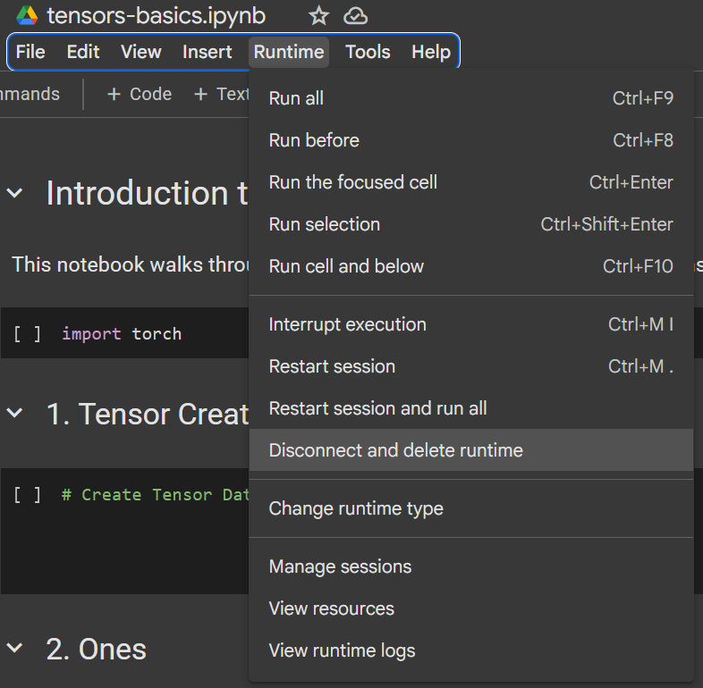

# Workshop Instructions

a. Clone this repo, using `git clone https://github.com/karthikeyanVK/gpt-learn.git`

b. Login to Google Colab, https://colab.research.google.com/, create an account if you have dont have one already.

## Tensor Basics

1. Open in a new tab,
 

2. Click on Connect and `Select Change runtime type`

3. Choose Select 'Runtime Type' - Python and 'Hardware accelerator' - T4 GPU, and click Save

5. Use [tensors-basics.ipynb](tensors-basics.ipynb) for instructions
6. In google colab start writing the commands given in tensors-basics.ipynb

7. Once Completed goto Menu->Runtime -> Disconnect and delete Runtime. This will make you ready for next module. 

## Bigram Instructions

1. Open [bigram.ipynb](https://colab.research.google.com/github/karthikeyanVK/gpt-learn/blob/main/bigram.ipynb), Select Github, paste this url and create a new Note book

2. Click on Connect and `Select Change runtime type`

3. Choose Select 'Runtime Type' - Python and 'Hardware accelerator' - T4 GPU, and click Save

5. Use [bigram.ipynb](bigram.ipynb) for instructions

6. In google colab start writing the commands given in bigram.ipynb

7. Once Completed goto Menu->Runtime -> Disconnect and delete Runtime. This will make you ready for next module. 

